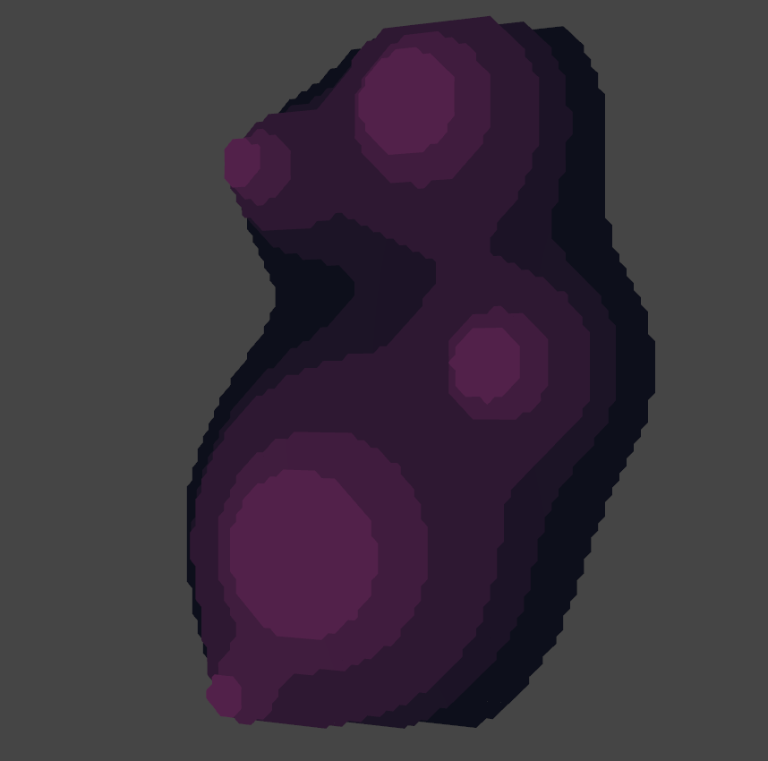

# Marching squares

Simple marching squares implementation in Rust with bevy game engine

## Build
```bash
$ git clone https://github.com/ShadowCurse/marching_squares
$ cd marching_squares
$ cargo build --release
```

## Example

